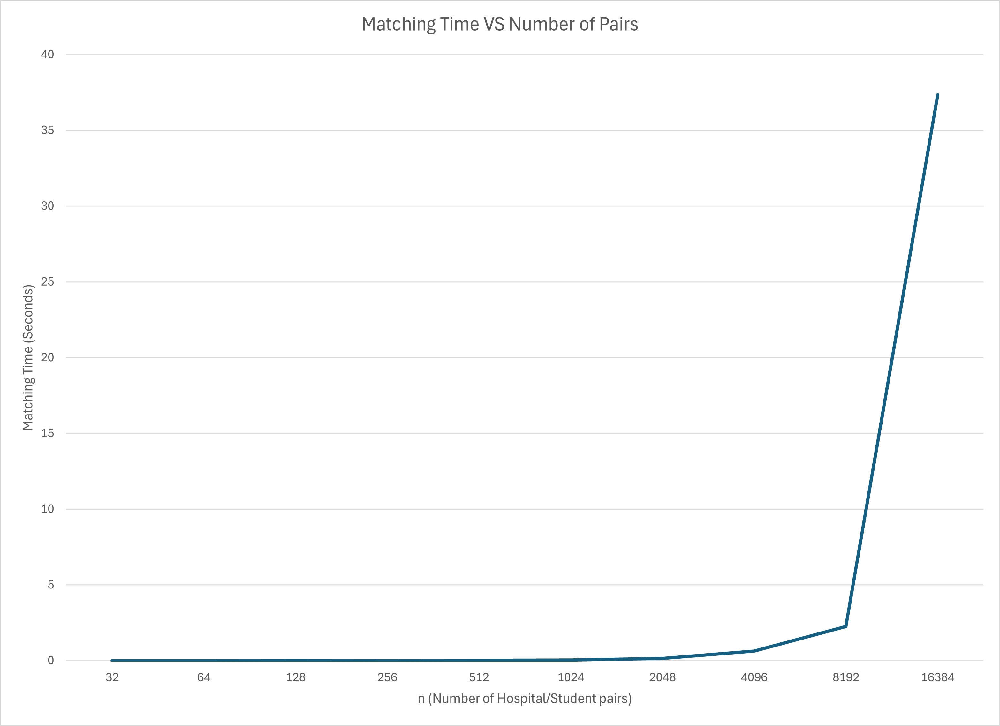
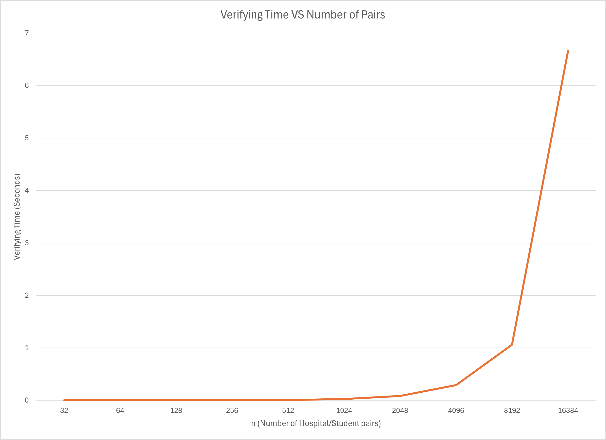

# COP4533 Programming Assignment 1: GaleShapley
Created by David Visbal Gomez (UFID: 11497647)

## Compile Instructions
1. Clone into a CLion repository.
2. Run the program in CLion.

## Matcher & Verifier Instructions
The matcher and verifier run together in the same program.
The user can choose to run one of the two individually or both
at once.
They will execute after all the data has been parsed in the
program.

Should you chose to run only the verifier, you must input the
data about the matches along with the data about the preferences.

There are three ways to input data.

1. Manually typing out the data by hand.
2. Passing in a text file.
3. Randomly generating the data.

After all the data has been processed, the output of the 
matching will go a file called "output.txt" in the
cmake-build-debug folder and the console will output 
whether the match is valid and stable, invalid, or unstable.

## Assumptions
Every input file must be in the "cmake-build-debug" folder for the program to read the file.

This program assumes you're running it in the CLion IDE with
the C++ standard set to C++ 17.

This program assumes that all id's of hospitals and students
are within bounds.  (1 <= x <= n) where x is the id of the hospital
or student.

## Task C
Below are two line graphs representing the running times of the
matching and verifying algorithms vs the size of input.  I decided
to use C++'s chrono library to measure the time it took for both
algorithms to finish given a specified size of input.

These algorithms were run on a laptop running Windows 11 with
8GB of RAM and 1GHz CPU.  All the input has been randomly generated
through the program's "generate_data()" function.

**Matching Time VS Number of Pairs**

**Verifying Time VS Number of Pairs**

I've noticed that the time it takes to match and verify increasing
numbers of pairs tends to grow exponentially.  All the running times
for both algorithms took less than 1 second for values of n less
than or equal to 4096 pairs.  The time for the algorithms to finish
skyrocketed at 16384 pairs (37.370 seconds to match and 6.666 seconds to
verify the matches).
